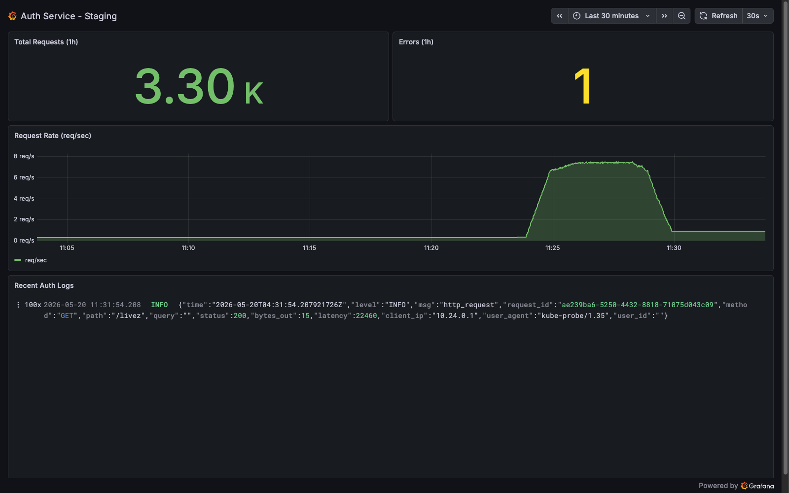

# Load testing — HPA autoscaling demo

A [k6](https://k6.io) load test that proves the staging `auth` Deployment
autoscales **1 → 2 → 3 pods** under CPU pressure, satisfying the high-traffic /
auto-scaling requirement (Part 3 of the assessment).

## What it does

`k6/register-spike.js` hammers `POST /auth/register` for ~5 minutes
(1m ramp to 20 VUs, then 4m hold). Registration runs **bcrypt** on every call,
which is CPU-bound, so the pods saturate their `500m` CPU limit and the HPA
(target: 70% of a `50m` request) scales out to its `maxReplicas: 3`.

We hit the API **origin-direct via `kubectl port-forward`**, deliberately
bypassing Cloudflare so the pods receive the full load instead of being
throttled at the edge.

> Why `/auth/register` and not `/auth/login` or an authenticated route?
> `/login` is per-IP rate limited (5/min) and authenticated routes are
> per-user/per-role token buckets — from a single source they return `429`
> before HPA ever sees CPU load. `/auth/register` is the only public endpoint
> with no rate-limit middleware, and it's bcrypt-heavy. The trade-off is that it
> writes real rows; see [Cleanup](#cleanup).

## Results — verified run (2026-05-20)

A live run against staging scaled the Deployment **1 → 2 → 3** in ~90 seconds.

**Request rate over the run** (Grafana, from Loki logs) — the traffic that drove
the scaling: a clean trapezoid rising to ~7 req/s, held for ~4 minutes, then
back to baseline.



**HPA response** (`kubectl get hpa auth`, CPU shown as % of the `50m` request;
pods cap at the `500m` limit ≈ 1000%):

| Time | CPU / target | Replicas | Event |
|---|---|---|---|
| baseline | 1% / 70% | 1 | k6 ramp starting |
| +~30s | 283% / 70% | 1 | threshold breached |
| +~40s | 992% / 70% | 1 | single pod pinned at its limit |
| +~60s | 992% / 70% | **2** | first scale-out |
| +~90s | 992% / 70% | **3** | scaled to max |
| hold | 500% → 334% | 3 | load now spread across 3 pods |

Final state: **3/3 pods Running across 2 nodes**. CPU redistributed
992% → 500% → 334% as replicas were added — confirming the new pods actually
received traffic via the Service, not just got scheduled.

**k6 summary** (5m01s, 20 VUs): `http_reqs` **1898** (6.27/s) ·
`http_req_failed` **0.00%** (✓ `<0.02`) · `http_req_duration p(95)` **4.59s**
(✓ `<5000`) · checks **1898/1898** 2xx.

> The Grafana panel shows request rate, not CPU/replicas (this public dashboard
> is log-derived). The HPA table above is the CPU/replica evidence, captured
> from `kubectl`. Together they show both the cause (traffic) and the effect
> (autoscaling).

## Prerequisites

- `k6` installed — `brew install k6`
- `kubectl` pointed at the staging cluster:
  ```sh
  gcloud container clusters get-credentials auth-cluster --region asia-southeast2
  kubectl config current-context   # should be the auth-cluster context
  ```

## Run it

Use three terminals.

**Terminal A — port-forward the Service:**
```sh
kubectl -n staging port-forward svc/auth 8080:80
```

**Terminal B — watch autoscaling (this is your evidence):**
```sh
kubectl -n staging get hpa auth -w
# in another pane:
kubectl -n staging get pods -l app=auth -w
```

**Terminal C — run the load test:**
```sh
# from the repo root
k6 run -e RUN_ID=$(date +%s) --summary-export loadtest/summary.json loadtest/k6/register-spike.js
# or:
make loadtest
```

`RUN_ID` tags every generated email so re-runs don't collide on the
`users.email` UNIQUE constraint. Override the target with
`-e BASE_URL=http://localhost:8080` if you forwarded to a different port.

## Capture the evidence

During the 4-minute hold you should see, in Terminal B, `REPLICAS` climb
`1 → 2 → 3` and the HPA `TARGETS` column exceed `70%`. Capture:

1. The `kubectl get hpa -w` / `get pods -w` output showing the replica climb.
2. The k6 end-of-test summary (and `loadtest/summary.json`).
3. A **Grafana** screenshot of CPU utilization + replica count over the run
   window — public dashboard:
   <https://shariski.grafana.net/public-dashboards/f63a038232084b678d72572f291e37ea>

Save the Grafana screenshot under `screenshots/` and commit it (see the
[Results](#results--verified-run-2026-05-20) section for the captured example).
Only the regenerated `summary.json` is git-ignored.

## Reading the results

- **`REPLICAS 1 → 3`** in the HPA watch = the deliverable is met.
- **Rising `http_req_duration`** in the k6 summary is *expected* — once pods are
  CPU-saturated, requests queue behind bcrypt. The `p(95)<5000` threshold is
  informational, not a system-health gate.
- **`http_req_failed` should stay under 2%.** If it breaches, that's a real
  signal (e.g. DB connection-pool exhaustion under load), not just slowness —
  investigate before trusting the run.

## Cleanup

The test creates one user (and one `audit_events` row) per request. Purge them
after the run.

**Required — delete the test users:**
```sh
kubectl -n staging exec -i statefulset/postgres -- \
  psql -U postgres -d auth -c \
  "DELETE FROM users WHERE email LIKE 'loadtest+%@k6.local';"
# or:
make loadtest-clean
```

**Optional — purge the audit rows from the run window** (safe on staging, which
has no real registrations during the test; `audit_events.actor_id` has no FK to
`users`, so order doesn't matter):
```sh
kubectl -n staging exec -i statefulset/postgres -- \
  psql -U postgres -d auth -c \
  "DELETE FROM audit_events WHERE action = 'POST /auth/register' AND created_at > now() - interval '1 hour';"
```

## Tuning

| Want | Change in `k6/register-spike.js` |
|---|---|
| Scale faster / harder | raise `target` in the `stages` (e.g. 40 VUs) |
| Longer soak | extend the hold `duration` |
| Also see scale-DOWN | add a `{ duration: '6m', target: 0 }` stage and keep watching — HPA scale-down has a 300s stabilization window |
